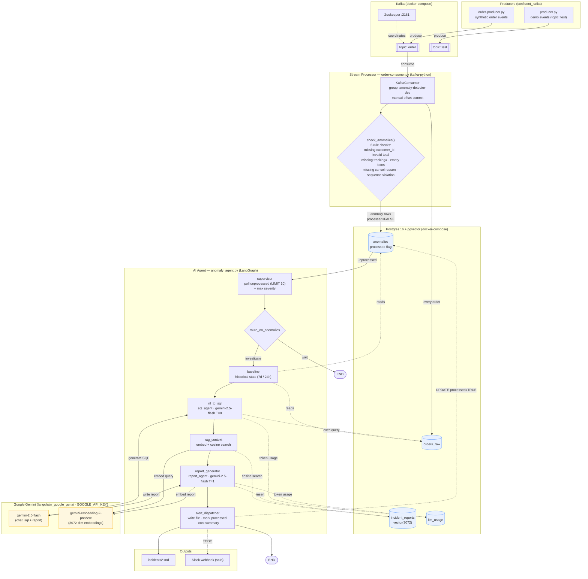

# AI Data Pipeline — Architecture

End-to-end: order events → Kafka → rule-based anomaly detection → Postgres → LangGraph AI agent (Gemini + pgvector RAG) → incident reports.

## Component diagram

## Flow summary

1. **Produce** — `order-producer.py` publishes order-lifecycle events to Kafka topic `order`.
2. **Detect** — `order-consumer.py` consumes each event, writes the raw record to `orders_raw`, and runs 6 rule-based checks. Violations are written to `anomalies` with `processed = FALSE`. Kafka offsets are committed manually after persistence.
3. **Investigate (LangGraph agent)** — `anomaly_agent.py` runs a 6-node graph:
   - `supervisor` polls up to 10 unprocessed anomalies; a conditional edge routes to `END` if there are none.
   - `baseline` pulls 7-day / 24-hour historical stats for context.
   - `nl_to_sql` uses `gemini-2.5-flash` (T=0) to generate + run a context query.
   - `rag_context` embeds the current anomalies with `gemini-embedding-2-preview` (3072-dim) and cosine-searches `incident_reports` for similar past incidents.
   - `report_generator` uses `gemini-2.5-flash` (T=1) to write a markdown report, then embeds + stores it back into `incident_reports` (the RAG memory loop).
   - `alert_dispatcher` writes the report to `incidents/*.md`, (stub) posts to Slack, marks the anomalies `processed = TRUE`, and prints a token/cost summary.
4. **Token accounting** — SQL and report agents record usage; `llm_usage` table is provisioned for persisting it.

## Infrastructure

- **docker-compose**: Zookeeper, Kafka (`confluentinc/cp-kafka:7.6.0`), Postgres (`pgvector/pgvector:pg16`). `init.sql` seeds all four tables + the `vector` extension on a fresh volume.
- **Secrets**: `GOOGLE_API_KEY` in `.env` (loaded via `load_dotenv()`).
- **k8s/**: Kubernetes manifests (alternate deploy target).
